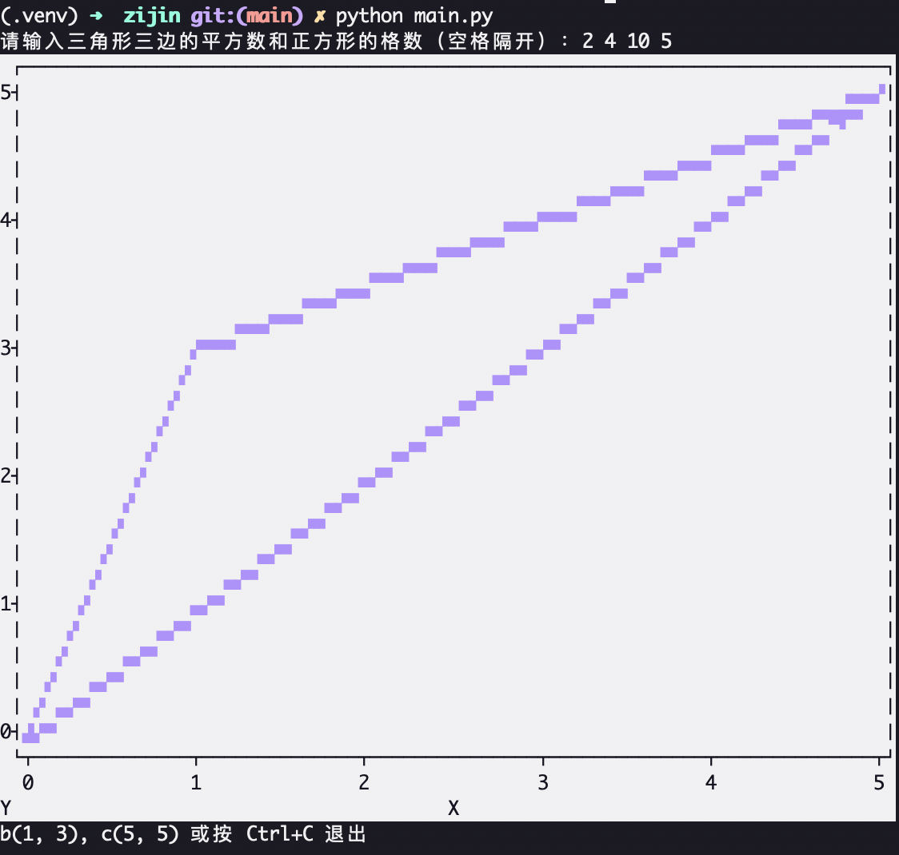

# zijin

<div align="center">

# 最大相似三角形

**在格点上寻找满足给定边长条件的最大相似三角形的Python程序**

[](https://www.python.org/downloads/release/python-3133/)
[](LICENSE)

</div>

---

## 📋 项目简介

这是一个专门设计用于解决几何问题的Python程序。它能够在给定的n×n格点上，根据三角形三边的平方值，寻找并绘制出符合条件的最大相似三角形。

程序通过数学验证和优化搜索算法，在保证精度的同时提高了计算效率，并提供了直观的终端可视化功能。

### 🎯 核心功能

- **智能搜索算法**：基于数学原理的高效三角形搜索
- **终端可视化**：使用plotext在终端直接绘制三角形
- **交互式界面**：友好的用户输入和实时反馈
- **数学验证**：严格验证三角形的几何约束条件
- **灵活扩展**：包含测试和基准测试功能

---

## 🧮 数学背景与算法原理

### 问题描述

给定一个三角形的三边平方值 `ab²`、`bc²`、`ac²`，在一个步长为1、边长为n的正方形格子上，求面积最大的相似三角形。

### 算法原理

1. **圆的交点原理**：通过两个圆的交点来确定三角形顶点的位置
2. **相似三角形性质**：利用相似三角形的边长比例关系进行缩放
3. **整数解验证**：确保所有顶点坐标都是格点上的整数
4. **优先搜索策略**：使用最大堆优先搜索可能的最大解

### 核心算法流程

```
1. 初始化最大堆，存储可能的C点位置
2. 按面积从大到小搜索：
   a. 验证相似三角形的边长比例
   b. 计算B点的可能位置
   c. 验证整数解约束
3. 找到第一个符合条件的解即为最大解
4. 绘制结果并输出坐标
```

---

## 🚀 安装步骤

### 环境要求

- Python 3.13.3 或更高版本
- pip 包管理器

### 安装依赖

```bash
# 克隆仓库
git clone https://github.com/dlsimple/zijin.git
cd zijin

# 安装依赖包
pip install plotext
```

### 依赖说明

- **plotext**：用于在终端绘制图表和图形
- **heapq**：Python标准库，用于堆队列算法
- **math**：Python标准库，用于数学运算

---

## 💻 使用方法

### 基本使用

运行程序后，按照提示输入四个整数（用空格隔开）：

```bash
python main.py
```

**输入格式：**
```
ab² bc² ac² n
```

**示例输入：**
```
请输入三角形三边的平方数和正方形的格数（空格隔开）：2 4 10 7
```

**输出结果：**
- 如果找到解：在终端绘制三角形，并显示顶点坐标
- 如果无解：显示"没有找到符合条件的三角形"

### 使用示例

```bash
# 示例1: 3-4-5直角三角形
请输入三角形三边的平方数和正方形的格数（空格隔开）：9 16 25 7
b(3, 0), c(0, 4)

# 示例2: 任意三角形
请输入三角形三边的平方数和正方形的格数（空格隔开）：2 4 10 7
没有找到符合条件的三角形
```

### 高级功能

#### 运行测试案例
```python
# 在main.py中取消注释
if __name__ == "__main__":
    # main()
    test()  # 运行预定义测试案例
```

#### 运行基准测试
```python
# 在main.py中取消注释
if __name__ == "__main__":
    # main()
    benchmark()  # 运行性能基准测试
```

---

## 📁 项目结构

```
zijin/
├── main.py              # 主程序文件
├── README.md            # 项目文档
├── example.png          # 示例图片
└── LICENSE              # 许可证文件
```

### 核心文件说明

**main.py** - 包含所有核心功能的单文件程序：

- `get_max_c_point(d)` - 从堆中获取最大面积的C点候选
- `get_max_b_point(ab2, bc2, ac2, c_point, n)` - 计算B点位置
- `max_similar_triangle(ab2, bc2, ac2, n)` - 主搜索算法
- `draw_triangle(b_point, c_point, n)` - 终端绘图函数
- `main()` - 交互式主程序
- `test()` - 测试函数
- `benchmark()` - 基准测试函数

---

## 🔧 核心函数文档

### `get_max_c_point(d)`
从优先队列中获取当前最大可能的C点，并生成下一级候选点。

**参数：**
- `d` - 最大堆，存储C点候选位置

**返回：**
- `(max_ac2, (cx, cy))` - 最大面积和对应的C点坐标

### `get_max_b_point(ab2, bc2, ac2, c_point, n)`
通过圆的交点原理计算B点的整数坐标。

**参数：**
- `ab2, bc2, ac2` - 三角形三边的平方值
- `c_point` - C点坐标元组
- `n` - 格点大小

**返回：**
- `False` - 无整数解
- `(bx, by)` - B点坐标

### `max_similar_triangle(ab2, bc2, ac2, n)`
主搜索函数，寻找格点上的最大相似三角形。

**算法复杂度：** O(n² log n) - 使用堆优化的搜索算法

**参数：**
- `ab2, bc2, ac2` - 三角形三边的平方值
- `n` - 格点边长

**返回：**
- `(False, False)` - 未找到解
- `(b_point, c_point)` - 三角形顶点坐标

### `draw_triangle(b_point, c_point, n)`
在终端绘制三角形网格。

**参数：**
- `b_point, c_point` - 三角形顶点坐标
- `n` - 格点大小

---

## 🛠️ 技术栈

- **编程语言**：Python 3.13.3
- **核心库**：
  - `math` - 数学运算和开方函数
  - `heapq` - 堆队列算法，用于优先搜索
  - `plotext` - 终端绘图库
- **算法技术**：
  - 最大堆优先搜索
  - 圆的交点计算
  - 整数解验证
  - 相似三角形几何变换

---

## 📊 算法复杂度分析

### 时间复杂度

- **主搜索算法**：O(n² log n)
  - 堆操作：O(log n) 每次插入/删除
  - 最坏情况下需要检查 O(n²) 个候选点
  
- **数学验证**：O(1) 每个候选点
  - 平方根计算和整数验证

### 空间复杂度

- **堆存储**：O(n²) 最坏情况下存储所有候选点
- **结果存储**：O(1) 常数空间

### 优化策略

1. **剪枝策略**：提前验证相似三角形条件，避免无效搜索
2. **优先搜索**：使用最大堆优先检查可能的最大解
3. **整数验证**：快速排除非整数解的情况

---

## 📸 示例



**图示说明**：在7×7格点上搜索3-4-5直角三角形的最大相似三角形。

---

## 🤝 贡献指南

欢迎提交Issue和Pull Request来改进这个项目！

### 开发建议

1. 保持代码简洁和可读性
2. 添加适当的注释和文档
3. 确保新功能有对应的测试案例
4. 遵循Python PEP 8代码风格

---

## 📄 许可证

MIT License

---

## 👨‍💻 作者

dlsimple

---

## 📮 联系方式

如有问题或建议，欢迎通过以下方式联系：

- 提交GitHub Issue
- 发送邮件到项目维护者

---

<div align="center">

**感谢使用 zijin 最大相似三角形程序！**

⭐ 如果觉得这个项目有帮助，请给个星标支持一下！

</div>